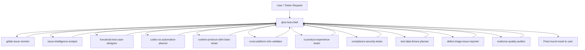

# Qbot Test Agent Team Architecture

## Scope

This agent team is built for Deepbank v2 / QBot test work. It is not an implementation team for product features. Its first responsibility is to turn GitLab issues, repository contracts, and meeting requirements into:

- systematic functional test cases grouped by product module;
- Excel-ready test case tables;
- Codex-executable Windows and macOS operation test flows;
- runtime/protocol/skill-chain regression coverage for Codex CLI + GLM5.2 style model routing;
- bug-vs-optimization conclusions with evidence;
- issue drafts or issue-creation handoffs when gaps are confirmed.

## Source Context

Primary repository:

- `D:\deepbankV2`
- Git remote: `https://gitlab.daikuan.qihoo.net/songrongxin/deepbankv2.git`

Current local facts used to design this team:

- Deepbank v2 / QBot is an Electron + React workbench backed by a Node HTTP/WS control plane.
- Runtime families are `claude-code` and `codex`; provider/model connection config is separate and resolved through a redacted connection view.
- Personal assistant turns run locally; project turns can route through a bound ADK runtime server.
- Product surfaces include assistant chat, experts, skills, connectors/MCP, projects, GitLab-backed project workbench, automation, release lanes, 360Teams embedding, and runtime-family/provider selection.
- Existing test entrypoints include `npm run check`, `npm run build:ui`, `npm run e2e:local`, `npm run e2e:qbot:codex:real`, `npm run e2e:qbot:claude-code:real`, `npm run codex:smoke`, runtime feature matrix commands, and release/e2e lanes.
- GitLab issue exports are present locally under `D:\deepbankV2\issues` and root issue JSON files.

The remote GitLab web page was not reachable from the current web channel during creation; the local clone, origin URL, repository docs, and exported issue JSON were used as the source of truth for this first architecture pass.

## Team Topology



## Agent Roster

| Agent | Type | Responsibility |
|---|---|---|
| `qbot-test-chief` | main | Owns orchestration, task routing, result synthesis, next-action planning, and the final user-facing result. |
| `gitlab-issue-monitor` | subagent | Monitors GitLab issue additions/changes, detects project scope drift, and recommends whether test plans need updates. |
| `issue-intelligence-analyst` | subagent | Reads GitLab issues and repository facts, normalizes issue scope, modules, risk, and traceability. |
| `functional-test-case-designer` | subagent | Designs complete functional test cases by module and prepares Excel-ready rows. |
| `codex-os-automation-planner` | subagent | Converts test intent into Codex-executable Windows/macOS operation procedures. |
| `runtime-protocol-skill-chain-tester` | subagent | Tests Codex CLI, GLM5.2/protocol-conversion assumptions, long tasks, skill invocation, and multi-skill chains. |
| `cross-platform-e2e-validator` | subagent | Owns OS, packaging, local/release/dev e2e command selection and platform-specific executable flows. |
| `ui-product-experience-tester` | subagent | Owns QBot UI/chat usability, visual/product behavior, accessibility, Teams/standalone shell experience. |
| `compliance-security-tester` | subagent | Owns M1-M4 compliance, secret redaction, auth/token boundaries, and data-leak negative cases. |
| `test-data-fixture-planner` | subagent | Owns fixtures, accounts, repo/test data readiness, skip/blocker semantics, and reproducibility. |
| `defect-triage-issue-reporter` | subagent | Decides bug vs optimization vs external dependency and drafts issue handoffs with evidence. |
| `evidence-quality-auditor` | subagent | Audits all outputs for false success, missing proof, redaction, traceability, and acceptance quality. |

## Orchestration Rules

1. The main agent reads source context, creates work packets, and assigns only the needed subagents.
2. The GitLab monitor may run before issue analysis when the question is about new issue drift, new features, or whether the test plan must change.
3. Subagents return structured results to the main agent; they do not issue final user conclusions directly.
4. The main agent resolves conflicts by checking source facts first, then asks for clarification only when acceptance would change.
5. Every generated test case must trace back to at least one source: issue, repository contract, meeting requirement, or observed behavior.
6. Missing live credentials, unavailable GitLab, blocked external dependencies, or skipped real-provider runs must be marked as blocked/skipped, not passed.
7. No agent may fabricate TestMind, GitLab, runtime, DB, UI, provider, MCP, model, log, or issue evidence.
8. Remote GitLab writes, issue creation, commits, pushes, or destructive environment changes require explicit user authorization.

## Standard Round Flow

1. Intake: main agent identifies objective, source scope, required artifacts, and success criteria.
2. Issue monitoring: GitLab monitor detects new/changed issues and reports whether test scope changed.
3. Issue map: issue analyst builds or refreshes the issue/module/risk matrix.
4. Test design: functional designer produces Excel-ready cases and traceability.
5. Automation design: automation planner converts eligible cases into Windows/macOS Codex operation flows.
6. Specialist reviews: runtime, UI, compliance, cross-platform, and data agents fill domain gaps.
7. Triage: defect reporter classifies confirmed gaps and drafts issues when needed.
8. Audit: evidence auditor checks proof, redaction, traceability, and blocked/skipped semantics.
9. Synthesis: main agent returns the final round result and the next recommended action.

## File Layout

```text
D:\QbotTestAgent
|-- TEAM_ARCHITECTURE.md
|-- references
|   |-- deepbank-project-context.md
|   `-- output-contracts.md
`-- agents
    |-- qbot-test-chief
    |   `-- SKILL.md
    |-- gitlab-issue-monitor
    |   `-- SKILL.md
    |-- issue-intelligence-analyst
    |   `-- SKILL.md
    |-- functional-test-case-designer
    |   `-- SKILL.md
    |-- codex-os-automation-planner
    |   `-- SKILL.md
    |-- runtime-protocol-skill-chain-tester
    |   `-- SKILL.md
    |-- cross-platform-e2e-validator
    |   `-- SKILL.md
    |-- ui-product-experience-tester
    |   `-- SKILL.md
    |-- compliance-security-tester
    |   `-- SKILL.md
    |-- test-data-fixture-planner
    |   `-- SKILL.md
    |-- defect-triage-issue-reporter
    |   `-- SKILL.md
    `-- evidence-quality-auditor
        `-- SKILL.md
```
